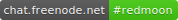
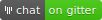

# Red Moon 

<!--  -->

Blue light may suppress the production of melatonin, the sleep hormone. Red Moon
filters out blue light and dims your screen below the normal minimum, so you can
use your phone comfortably at night.

* Schedule Red Moon to run from sunset to sunrise, or at custom times.
* Use the default color profiles, or set custom color, intensity, and dim levels.
* Automatically pause in apps that are secured against overlays, or those you choose.
* Quickly start, stop, and switch filters via notification, tile (Android 7.0+), or widget.

## Join the community

Communities keep software projects alive. Without them, projects usually fade
into obscurity when the primary developer loses interest or becomes busy in
other parts of their life. That's where you come in! You can:

- Read through the [issues] and give a <g-emoji alias="+1" class="emoji" fallback-src="https://assets-cdn.github.com/images/icons/emoji/unicode/1f44d.png" ios-version="6.0">👍</g-emoji> to the ones you care about most.
    - Share opinions and ideas on issues tagged [`feedback wanted`] or [`needs design`].
    - Try to find steps to trigger bugs tagged [`can't reproduce`].
    - Android developers: some issues [`need technical info`].
- Open [new issues] with feedback, feature requests, or bug reports.
- Help translate using [Weblate]. 
- Join the chat at ,
    ,
    or 

## Screenshots & translation stats

  

Screenshots are slightly out of date.

## Development

### Building

To build the app on GNU+Linux, clone the repository, then, from the root directory, run

`./gradlew build`

To install the app on a connected device or running emulator, run

`./gradlew installFdroidDebug` or `./gradlew installPlaystoreDebug`

### Pull requests

- We're happy to answer questions if you reach out via an issue, the chat room(s), or email.
- If your change makes the UI more complicated, we suggest checking if we're
    interested before you implement it.
- Please keep code and translations in separate PRs.

### Style

**Prioritize legibility over dogmatism.** That said, consistency is nice, so
here's a short list of what I've been doing. 

- 100 characters per line; 80 if you can.
- Indent 4 spaces, or 8 spaces if the previous line ends with `=`.
- `CONSTANTS` and `ENUMS` use all caps, `variableNames` use camelCase.
- Form suggests function: Group and align similar actions, and *don't* align dissimmilar ones, even if you could.
- Good comments explain *why* something is done; if you find yourself describing *what* the code does, consider:
    - Refactoring into smaller functions with descriptive names
    - Converting comments to logs. Code that requires comments probably also requires good logs to debug.
- Don't omit the curly braces from `if` statements except short variable assignment (`val x = if (a) b else c`)

### License

*Red Moon* is a derivative of *[Shades](https://github.com/cngu/shades)* by
[Chris Nguyen](https://github.com/cngu), used under the
[MIT License](https://github.com/cngu/shades/blob/e240edc1df3e6dd319cd475a739570ff8367d7f8/LICENSE).
*Red Moon* is licensed under the
[GNU General Public License version 3](https://www.gnu.org/licenses/gpl-3.0.html),
or (at your option) any later version by
[the contributors](https://github.com/raatmarien/red-moon/graphs/contributors).

All used artwork is released into the public domain. Some of the icons
use cliparts from [openclipart.org](https://openclipart.org/), which
are all released in the public domain, namely:

* https://openclipart.org/detail/121903/full-moon
* https://openclipart.org/detail/219211/option-button-symbol-minimal-svg-markup
* https://openclipart.org/detail/20806/wolf-head-howl-1
* https://openclipart.org/detail/213998/nexus-5-flat
* https://openclipart.org/detail/192689/press-button

---

\* Google Play and the Google Play logo are trademarks of Google Inc.

[irc]: https://kiwiirc.com/client/irc.freenode.net/#redmoon
[gitter]: https://gitter.im/LibreShift/red-moon
[matrix]: https://matrix.to/#/#redmoon:matrix.org
[issues]: https://github.com/raatmarien/red-moon/issues
[new issues]: https://github.com/raatmarien/red-moon/issues/new
[Weblate]: https://hosted.weblate.org/projects/red-moon/strings/
[labels]: https://github.com/LibreShift/red-moon/labels
[`feedback wanted`]: https://github.com/LibreShift/red-moon/labels/feedback%20wanted
[`needs design`]: https://github.com/LibreShift/red-moon/labels/needs%20design
[`can't reproduce`]: https://github.com/LibreShift/red-moon/labels/can%27t%20reproduce
[`need technical info`]: https://github.com/LibreShift/red-moon/labels/needs%20technical%20info
